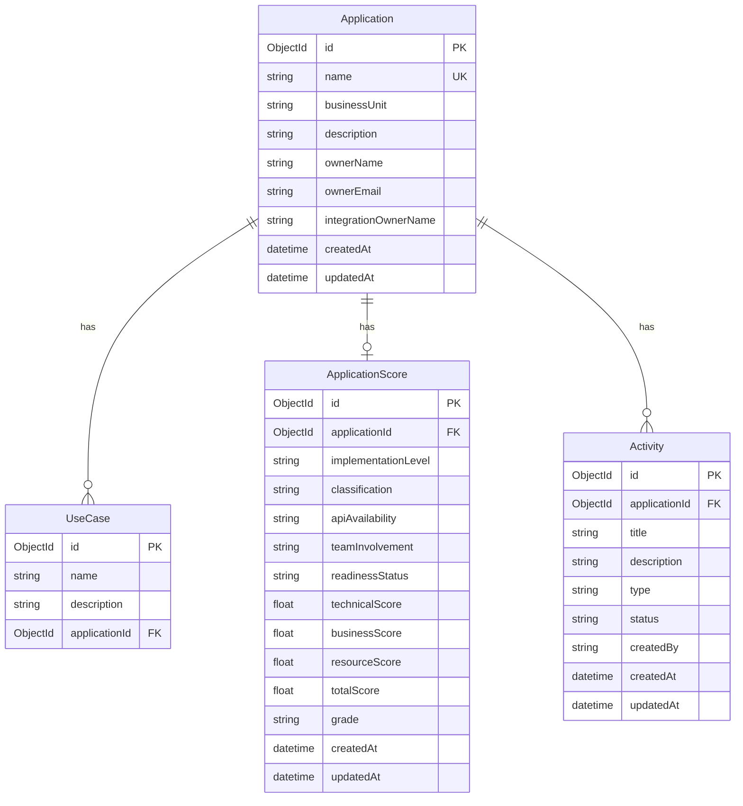

# PulseOS Demo & Experimentation Platform

This application serves as a demonstration and experimentation platform designed to help clients visualize PulseOS workflow outputs in an interactive and playful way. It provides architectural examples and implementation patterns that clients can adopt when integrating their applications with PulseOS.

## Purpose

- **Demonstrations**: Showcase PulseOS capabilities and workflow outputs through interactive visualizations
- **Experimentation**: Provide a sandbox environment for testing different integration patterns and features
- **Client Visualization**: Help clients understand how their workflows will look and behave in real-world scenarios
- **Architectural Guidance**: Expose implementation options and best practices for PulseOS integration

## Architecture Overview

This application follows modern web architecture patterns and demonstrates several integration approaches that clients can implement in their own applications.

### Backend for Frontend (BFF) Pattern

The application implements a Backend for Frontend (BFF) pattern to provide a tailored API layer between the client interface and PulseOS services. This approach offers several benefits:

- **API Aggregation**: Combines multiple PulseOS service calls into optimized client-specific endpoints
- **Authentication Handling**: Manages OAuth flows and token management transparently
- **Request/Response Transformation**: Adapts PulseOS APIs to match client application needs
- **Security Layer**: Adds an additional security boundary between public clients and internal services

### Pulse Proxy Endpoint

The `/pulse` endpoint serves as a critical proxy component in the architecture:

**Functionality:**
- Receives calls from the chatbot interface
- Adds proper authorization headers for PulseOS authentication
- Redirects requests to the appropriate PulseOS endpoints
- Handles response transformation and error management

**Benefits:**
- **Transparent Authentication**: Clients don't need to manage PulseOS credentials directly
- **Simplified Integration**: Single endpoint for chatbot communication
- **Security**: Credentials and internal URLs are abstracted from client applications
- **Flexibility**: Easy to modify routing and add middleware without client changes

## Database Schema

The application includes a comprehensive database schema for managing applications, their use cases, scores, and activities. The schema is built using Prisma with MongoDB (designed for Azure Cosmos DB with MongoDB API) and follows a simplified approach with direct field storage for ease of use.



### Key Features of the Schema:

- **Simplified Structure**: Direct field storage for owners and integration owners (no complex relationships)
- **Comprehensive Scoring**: Detailed scoring system with technical, business, and resource metrics
- **Activity Tracking**: Complete audit trail for application follow-ups and status changes
- **Flexible Design**: Easy to extend with additional fields as requirements grow

For detailed setup instructions and API documentation, see [DATABASE_SETUP.md](DATABASE_SETUP.md).

## Important Security Disclaimer

⚠️ **For Demonstration Purposes Only**

This application has been simplified for demonstration and experimentation purposes and **does not persist any data**. As a result, all authentication data, including tokens and session information, is stored directly in cookies.

**This is NOT a recommended security pattern for production applications.**

### Recommended Security Best Practices

In production applications, you should implement proper session management:

1. **Secure Session Storage**: Store session data, tokens, and user information in a secure storage system
2. **Minimal Cookie Data**: Cookies should only contain a session ID or similar identifier
3. **Secure Session Lookup**: Use the session ID to retrieve full session data from your storage system
4. **Token Security**: Never store sensitive tokens, secrets, or user data directly in cookies

### Why This Matters

- **Security**: Cookies can be intercepted, stolen, or manipulated by malicious actors
- **Size Limitations**: Cookies have size restrictions that can limit the data you can store
- **Performance**: Large cookies increase request size and network overhead
- **Compliance**: Many security standards require proper session management practices
- **Scalability**: Proper session management allows for better handling across multiple servers

### Implementation in Your Applications

When implementing similar functionality in your production applications:

```javascript
// ❌ Avoid: Storing sensitive data in cookies
document.cookie = "user_token=eyJhbGciOiJIUzI1NiIsInR5cCI6IkpXVCJ9...";

// ✅ Recommended: Store only session ID in cookies
document.cookie = "session_id=abc123def456";
// Then lookup full session data from your storage system using session_id
```

This demonstration platform prioritizes simplicity and ease of setup over security best practices to facilitate learning and experimentation.

## Getting Started

### Prerequisites

- Node.js 18+ 
- PulseOS access credentials

### Environment Setup

1. Copy the environment template:
```bash
cp .env_token .env.local
```

2. Update the environment variables with your specific configuration:
```bash

# Custom OAuth Provider
CUSTOM_OAUTH_CLIENT_ID="your-client-id"
CUSTOM_OAUTH_CLIENT_SECRET_ID="your-client-secret-id"
CUSTOM_OAUTH_CLIENT_SECRET="your-client-secret"
CUSTOM_OAUTH_ISSUER="https://your-oauth-provider.com"
```

### Development

1. Install dependencies:
```bash
npm install
```

2. Run the development server:
```bash
npm run dev
```

3. Open [http://localhost:8990](http://localhost:8990) to access the application

## API Documentation

Interactive API documentation is available at `/api-docs` when running the application. This includes detailed information about:

- Authentication endpoints
- Pulse proxy endpoints
- Client management APIs
- Invoice and provider services

## Integration Examples

The application demonstrates several integration patterns that clients can implement:

1. **OAuth Integration**: Complete OAuth flow implementation with PulseOS
2. **Proxy Pattern**: How to create secure proxy endpoints for internal service communication
3. **Session Management**: Best practices for handling user sessions and authentication state
4. **API Composition**: Combining multiple service calls into cohesive client experiences

## Deployment

The application is configured for deployment on Vercel with the included `vercel.json` configuration. For other platforms, ensure environment variables are properly configured in your deployment environment.

## Contributing

When contributing to this demonstration platform, please ensure that:
- New features serve as clear examples for client implementation
- Code is well-documented to serve as reference material
- Security best practices are maintained throughout
- Integration patterns are clearly explained and documented
